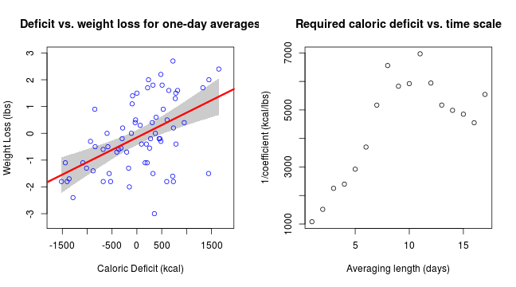

<style>
strong {
  font-weight: bold;
}
</style>

<style>
em {
  font-style: italic;
}
</style>

## Motivation for this app  
<br>
There are many weight loss strategies out there. One of the most common quantitative approaches is to maintain a *caloric deficit*. That is, you must expend more calories than you consume.  
<br>  
**Common rule of thumb**: to lose one pound (of fat), one must accumulate a caloric deficit of 3500kcal.  
<br>
This app linearly regresses caloric deficit with daily changes in weight. It also addresses the question of time scale:  

- does the day-to-day relationship persist over longer time scales?
- is there a time lag between a deficit and the subsequent weight loss?

---

## Details

Inputs:

1. Time window over which to average caloric deficit
2. Time window over which to average weight change
3. Difference between start of windows (weight change must lag deficit)

Default inputs:

- time windows = 1 day
- time lag = 0 days

Default data set:

- from author's personal weight/diet log
- only 68 days (really needs larger sample size)

---
## Calculation

The app takes the three input integers and forms a new data frame, then runs linear regression:

```r
wldata <- read.csv('CPdata.csv')
input <- data.frame(defspan = 1, lossspan = 1, lag = 0)
N <- 68 - max(input$lossspan + input$lag, input$defspan) + 1
procdf <- data.frame(Deficit = rep(0,N), Loss = rep(0,N))
for (j in 1:N){
  procdf[j,1] = mean(wldata[(j+input$lag):(j+input$defspan-1+input$lag),1])
  procdf[j,2] = mean(wldata[j:(j+input$lossspan-1),2])}
mod <- lm(Loss~Deficit, procdf)
summary(mod)$coefficients
```

```
##                  Estimate   Std. Error   t value     Pr(>|t|)
## (Intercept) -0.1551362173 0.1405491129 -1.103787 2.736939e-01
## Deficit      0.0009248749 0.0001935031  4.779638 1.020147e-05
```

--- .class #id 

## Results

 

- The default plot is on the left, suggesting a deficit of 1000-1100kcal is needed to lose one pound.
- As shown on the right, if one increases `lossspan` and `defspan` concurrently, the needed deficit increases and then levels off around 5000-6000kcal.


